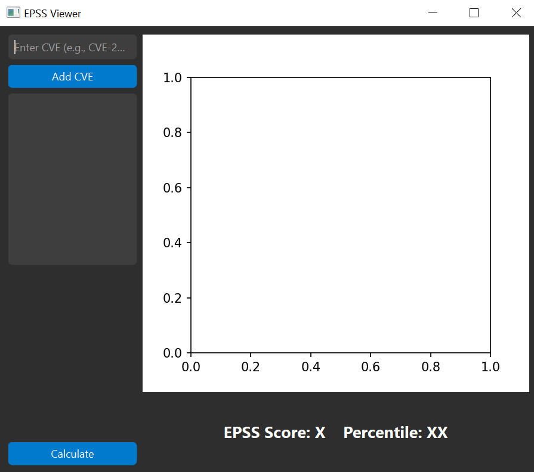
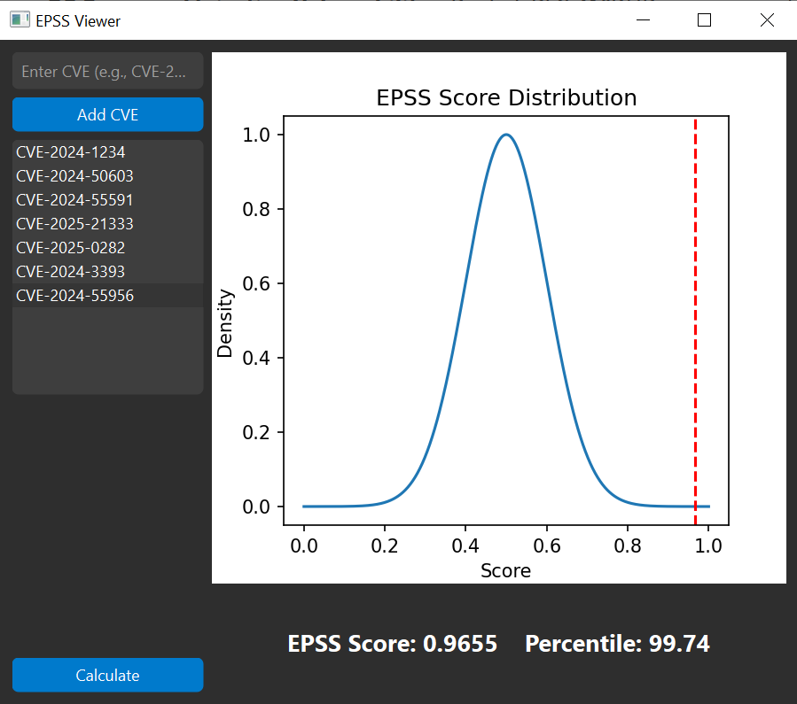

# EPSS Viewer

EPSS Viewer is a PySide6-based desktop GUI application that provides a visual representation of Exploit Prediction Scoring System (EPSS) data for CVEs (Common Vulnerabilities and Exposures). It allows users to input CVE identifiers, fetch EPSS scores from the FIRST.org API, and visualize the results on a bell curve.

---

## Features

- **Input CVEs**: Add and manage a list of CVEs through the GUI.
- **EPSS Score Calculation**: Fetch EPSS scores and percentiles dynamically from the FIRST.org API.
- **Bell Curve Visualization**: Display EPSS scores on a bell curve for better understanding of the distribution.
- **Interactive GUI**: Easy-to-use interface with modern design and dark theme.

---

## Installation

### Prerequisites

1. Python 3.8 or higher.
2. Virtual environment tool (e.g., `venv`).

### Steps

1. **Clone the Repository**

   ```bash
   git clone https://github.com/your-repo/epss-viewer.git
   cd epss-viewer
   ```

2. **Set Up Virtual Environment**

   ```bash
   python -m venv venv
   source venv/bin/activate   # On Windows: venv\Scripts\activate
   ```

3. **Install Dependencies**

   ```bash
   pip install -r requirements.txt
   ```

4. **Run the Application**

   ```bash
   python epss_viewer.py
   ```

---

## Usage

1. Launch the application.
2. Enter a CVE (e.g., `CVE-2024-1234`) in the input field and click **Add CVE**.
3. Select a CVE from the list and click **Calculate** to fetch the EPSS score.
4. View the EPSS score and percentile displayed below the bell curve.

---

## Project Structure

```
.
├── epss_viewer.py       # Main application code
├── requirements.txt    # Python dependencies
└── README.md           # Project documentation
```

---

## Dependencies

- **PySide6**: For building the graphical user interface.
- **Matplotlib**: For visualizing the bell curve.
- **Requests**: For fetching data from the EPSS API.
- **NumPy**: For mathematical operations.

Refer to `requirements.txt` for the complete list.

---

## API Integration

EPSS Viewer uses the [FIRST.org EPSS API](https://www.first.org/epss/) to retrieve EPSS data. The application dynamically fetches scores and percentiles for CVEs based on the current date.

**Example API Call:**

```
GET https://api.first.org/data/v1/epss?cve=<CVE-ID>&curr_date=<YYYY-MM-DD>
```

---

## Screenshots




---

## Troubleshooting

- **Error: Missing Dependencies**:
  Ensure all dependencies are installed by running:

  ```bash
  pip install -r requirements.txt
  ```

- **Error Fetching EPSS Data**:
  Check your internet connection and verify that the CVE ID is valid.

---

## Contributing

Contributions are welcome! Feel free to open issues or submit pull requests.


---

## Acknowledgments

- [FIRST.org](https://www.first.org/) for the EPSS API.
- SimplyCyber community for introducing me to the EPSS API 
- The Python and PySide6 communities for their fantastic tools.

Thanks!&#x20;
